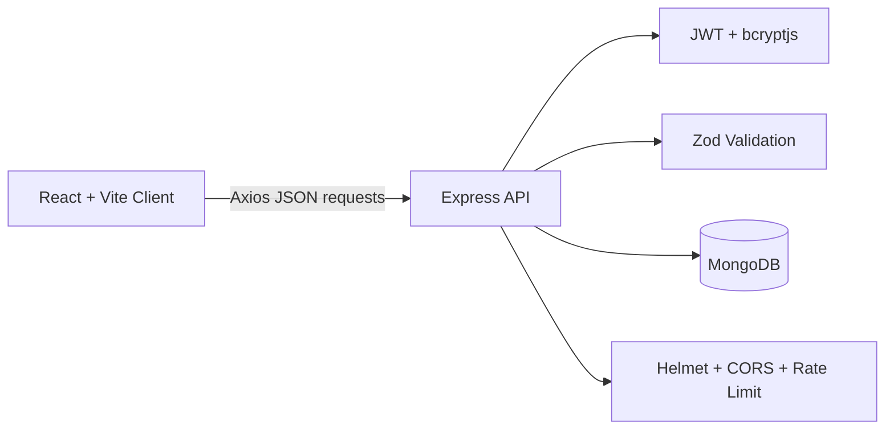
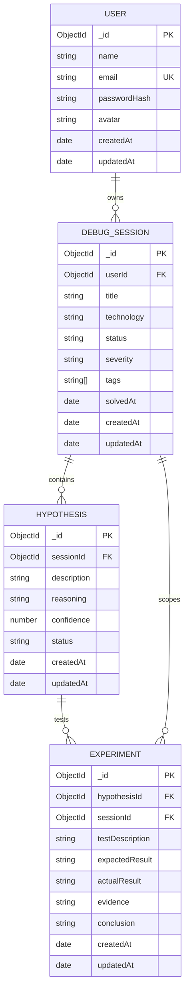

# DevTrace

DevTrace is a developer debugging journal for preserving the reasoning behind software investigations.

## Problem

Debugging often ends with a fix but loses the path that led there. Weeks later, the same failure can require the same experiments, log searches, and false starts because the original reasoning was never recorded.

## Solution

DevTrace captures a debugging investigation as a connected journey:

**Problem -> Hypothesis -> Experiment -> Evidence -> Root Cause -> Solution -> Lesson**

The application keeps the observed failure, possible explanations, tests, results, diagnosis, fix, and lesson in one searchable record.

## Features

- Authentication: register, login, logout, current user, and protected routes
- Debugging sessions: create, read, update, delete, search, filtering, sorting, and pagination
- Hypotheses: multiple hypotheses per session, confidence, reasoning, and status
- Experiments: expected result, actual result, evidence, conclusion, and CRUD operations
- Search: server-side search across session context and resolution fields
- Filtering: status, technology, and severity filters
- Dashboard: user-scoped session statistics, technology distribution, and recent sessions
- Timeline: chronological debugging journey assembled from session, hypothesis, and experiment data

## Tech Stack

### Frontend

- React 19 with Vite
- React Router
- Axios
- TanStack Query
- React Hook Form and Zod
- Lucide React
- Recharts
- CSS-based responsive visual system with dark developer-tool styling

### Backend

- Node.js
- Express
- Mongoose
- Zod request validation

### Database

- MongoDB
- Mongoose models for User, DebugSession, Hypothesis, and Experiment

### Security

- JWT bearer authentication
- bcryptjs password hashing
- Helmet
- CORS
- express-rate-limit on authentication routes
- Ownership-scoped database queries

### Development Tools

- npm workspaces
- ESLint
- Prettier
- Nodemon

## Architecture



The client uses TanStack Query for server state and sends authenticated requests with a bearer token. Express validates input, applies authentication and ownership checks, and persists data through Mongoose.

## Database Model



## API

All routes are prefixed with `/api`. Protected routes require `Authorization: Bearer <jwt>`.

### Health and Authentication

| Method | Endpoint         | Description                          |
| ------ | ---------------- | ------------------------------------ |
| GET    | `/health`        | API health check                     |
| POST   | `/auth/register` | Create an account                    |
| POST   | `/auth/login`    | Authenticate and receive a JWT       |
| GET    | `/auth/me`       | Return the authenticated user        |
| POST   | `/auth/logout`   | Confirm logout for the current token |

### Sessions and Dashboard

| Method | Endpoint           | Description                                                             |
| ------ | ------------------ | ----------------------------------------------------------------------- |
| GET    | `/sessions`        | List owned sessions with search, filters, sorting, and pagination       |
| POST   | `/sessions`        | Create an owned debugging session                                       |
| GET    | `/sessions/:id`    | Read an owned session                                                   |
| PATCH  | `/sessions/:id`    | Update an owned session                                                 |
| DELETE | `/sessions/:id`    | Delete an owned session and child records                               |
| GET    | `/dashboard/stats` | Return user-scoped counts, technology distribution, and recent sessions |

### Hypotheses and Experiments

| Method | Endpoint                                | Description                                    |
| ------ | --------------------------------------- | ---------------------------------------------- |
| GET    | `/sessions/:sessionId/hypotheses`       | List hypotheses for an owned session           |
| POST   | `/sessions/:sessionId/hypotheses`       | Create a hypothesis under an owned session     |
| PATCH  | `/hypotheses/:id`                       | Update an owned hypothesis                     |
| DELETE | `/hypotheses/:id`                       | Delete an owned hypothesis                     |
| GET    | `/hypotheses/:hypothesisId/experiments` | List experiments for an owned hypothesis       |
| POST   | `/hypotheses/:hypothesisId/experiments` | Create an experiment under an owned hypothesis |
| PATCH  | `/experiments/:id`                      | Update an owned experiment                     |
| DELETE | `/experiments/:id`                      | Delete an owned experiment                     |

API errors use a consistent response shape:

```json
{
  "success": false,
  "error": {
    "code": "VALIDATION_ERROR",
    "message": "Request validation failed",
    "details": []
  }
}
```

## Screenshots

Screenshots are reserved for the documentation pass. Suggested captures:

```text
docs/screenshots/login.png
docs/screenshots/dashboard.png
docs/screenshots/sessions.png
docs/screenshots/session-details.png
```

## Local Setup

### Prerequisites

- Node.js 20 or newer
- npm 10 or newer
- A reachable MongoDB instance for database-backed features

### Install

From the repository root:

```bash
npm install
```

### Configure

Copy the example environment file to a local environment file for development:

```powershell
Copy-Item .env.example .env
```

Update `MONGODB_URI` and replace the example `JWT_SECRET` with a random secret of at least 32 characters. Never commit `.env`.

### Start the applications

Run the backend and frontend in separate terminals:

```bash
npm run dev:server
npm run dev:client
```

The default URLs are:

- Frontend: `http://localhost:5173`
- API: `http://localhost:5000`
- Health check: `http://localhost:5000/api/health`

### Validate

```bash
npm run lint
npm run build
npm run format:check
npm run validate
```

There is currently no automated `npm test` script configured.

## Environment Variables

Use [.env.example](.env.example) as the template. It documents the non-secret configuration required by the client and server:

| Variable                              | Purpose                                       |
| ------------------------------------- | --------------------------------------------- |
| `PORT`                                | Express server port                           |
| `CLIENT_ORIGIN`                       | Allowed browser origin for CORS               |
| `VITE_API_URL`                        | API base URL used by the Vite client          |
| `MONGODB_URI`                         | MongoDB connection string                     |
| `MONGODB_SERVER_SELECTION_TIMEOUT_MS` | MongoDB connection timeout                    |
| `JWT_SECRET`                          | JWT signing secret; use a strong local secret |
| `JWT_EXPIRES_IN`                      | JWT lifetime, such as `15m`                   |

No real `.env` file or credentials belong in the repository.

## Project Structure

```text
DevTrace/
├── client/
│   ├── src/
│   │   ├── api/          Axios API modules
│   │   ├── components/   Shared forms, cards, timelines, and layouts
│   │   ├── context/      Authentication context
│   │   ├── hooks/        TanStack Query and UI hooks
│   │   └── pages/        Route-level screens
│   └── package.json
├── server/
│   ├── src/
│   │   ├── config/       Environment and database configuration
│   │   ├── controllers/  Request handlers
│   │   ├── middleware/   Auth, validation, security, and errors
│   │   ├── models/       Mongoose models
│   │   ├── routes/       Express route modules
│   │   ├── utils/        Shared API and auth utilities
│   │   └── validators/   Zod request schemas
│   └── package.json
├── docs/
│   ├── api.md
│   ├── architecture.md
│   └── database.md
├── .env.example
├── package.json
└── package-lock.json
```

## Security

- Passwords are hashed with bcryptjs and only `passwordHash` is stored; plaintext passwords are never persisted or serialized.
- JWTs are signed with `JWT_SECRET`, restricted to the `HS256` algorithm, and verified through bearer authentication middleware.
- Authentication routes are rate-limited.
- Helmet and CORS are applied at the Express boundary.
- Zod validates request bodies, route parameters, and query parameters.
- Session queries always include the authenticated user ID.
- Hypotheses are authorized through their parent `DebugSession`.
- Experiments are authorized through the chain `Experiment -> Hypothesis -> DebugSession -> User`.
- Child hypotheses and experiments are removed when an owned session is deleted.
- Database-unavailable requests fail with a standardized configuration response without exposing driver details.

## Future Improvements

Potential future work includes:

- Optional AI-assisted analysis of debugging records
- Team collaboration and shared workspaces
- Richer analytics and long-term debugging trends
- Automated integration tests backed by an isolated MongoDB test database

The current project does not include AI functionality or team collaboration.
