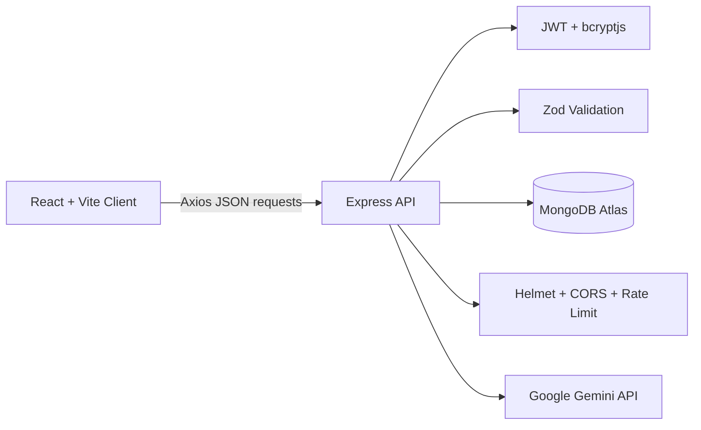
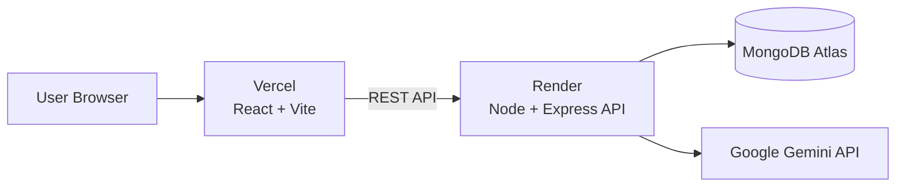
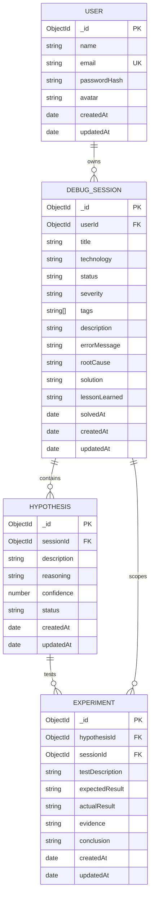

# DevTrace

DevTrace is a developer debugging journal for preserving the reasoning behind software investigations.

Instead of recording only the final fix, DevTrace captures the complete debugging journey — from the original problem and hypotheses to experiments, evidence, root cause, solution, lessons, and AI-assisted analysis.

---

## Problem

Debugging often ends with a fix but loses the path that led there. Weeks later, the same failure can require the same experiments, log searches, and false starts because the original reasoning was never recorded.

Developers need a structured way to preserve not only **what fixed a problem**, but also **why the solution was reached**.

---

## Solution

DevTrace captures a debugging investigation as a connected journey:

**Problem → Hypothesis → Experiment → Evidence → Root Cause → Solution → Lesson**

Each investigation keeps the observed failure, possible explanations, tests, results, diagnosis, fix, and lesson in one searchable record.

DevTrace also provides **AI-powered investigation analysis** that reviews recorded debugging data and generates structured insights about the investigation.

---

## Features

### Authentication
- User registration and login
- JWT-based authentication
- Logout
- Current-user session
- Protected routes
- Password hashing with bcryptjs

### Debugging Sessions
- Create debugging sessions
- View session details
- Update sessions
- Delete sessions
- Search sessions
- Filter by status, technology, and severity
- Sorting and pagination
- Session status tracking
- Root cause, solution, and lesson recording

### Hypotheses
- Create multiple hypotheses for a debugging session
- Record reasoning behind each hypothesis
- Assign confidence levels
- Track hypothesis status
- Confirm or reject hypotheses
- Maintain chronological investigation history

### Experiments
- Create experiments for hypotheses
- Define test descriptions
- Record expected results
- Record actual results
- Store evidence
- Record conclusions
- Update and delete experiments

### Search & Filtering
- Server-side search
- Search across debugging context and resolution fields
- Status filtering
- Technology filtering
- Severity filtering
- Sorting
- Pagination

### Dashboard
- User-scoped debugging statistics
- Session counts
- Technology distribution
- Recent debugging sessions
- Investigation overview

### Debugging Timeline
- Chronological investigation timeline
- Session → Hypothesis → Experiment flow
- Visual representation of the debugging journey
- Helps developers understand how the final diagnosis was reached

### AI-Powered Investigation Analysis
DevTrace can analyze a completed debugging investigation using a Gemini-powered AI service.

The AI receives the recorded investigation data and generates structured insights covering:

- Investigation summary
- Experiment sequence
- Debugging efficiency
- Repeated patterns
- Lessons learned
- Hypothesis counts
- Rejected hypotheses
- Confirmed hypotheses
- Experiment order and outcomes

The AI is instructed to base its analysis strictly on the recorded investigation data and avoid inventing missing information.

AI analysis is available through the **Analyze with AI** feature on session details.

---

## Tech Stack

### Frontend

- React 19
- Vite
- React Router
- Axios
- TanStack Query
- React Hook Form
- Zod
- Lucide React
- Recharts
- CSS-based responsive UI
- Dark developer-tool inspired visual system

### Backend

- Node.js
- Express
- Mongoose
- Zod
- JWT
- bcryptjs

### Database

- MongoDB
- MongoDB Atlas
- Mongoose

### AI

- Google Gemini API
- `@google/genai`
- Configurable Gemini model through environment variables
- Structured prompt-based debugging analysis

### Security

- JWT bearer authentication
- bcryptjs password hashing
- Helmet
- CORS
- express-rate-limit on authentication routes
- Ownership-scoped database queries
- Zod request validation

### Development Tools

- npm workspaces
- ESLint
- Prettier
- Nodemon
- Git
- GitHub

### Deployment

- Vercel — frontend
- Render — backend
- MongoDB Atlas — database

---

## Architecture



### Production Architecture



The client uses TanStack Query for server state and Axios for API communication.

Express validates input, applies authentication and ownership checks, and persists data through Mongoose.

AI analysis is handled by a dedicated backend AI service. Sensitive API credentials remain on the server and are never exposed to the client.

---

## Database Model



---

## API

All routes are prefixed with `/api`.

Protected routes require:

```text
Authorization: Bearer <jwt>
```

### Health and Authentication

| Method | Endpoint | Description |
|---|---|---|
| GET | `/health` | API health check |
| POST | `/auth/register` | Create an account |
| POST | `/auth/login` | Authenticate and receive a JWT |
| GET | `/auth/me` | Return the authenticated user |
| POST | `/auth/logout` | Confirm logout for the current token |

### Sessions and Dashboard

| Method | Endpoint | Description |
|---|---|---|
| GET | `/sessions` | List owned sessions with search, filters, sorting, and pagination |
| POST | `/sessions` | Create an owned debugging session |
| GET | `/sessions/:id` | Read an owned session |
| PATCH | `/sessions/:id` | Update an owned session |
| DELETE | `/sessions/:id` | Delete an owned session and child records |
| GET | `/dashboard/stats` | Return user-scoped counts, technology distribution, and recent sessions |

### Hypotheses

| Method | Endpoint | Description |
|---|---|---|
| GET | `/sessions/:sessionId/hypotheses` | List hypotheses for an owned session |
| POST | `/sessions/:sessionId/hypotheses` | Create a hypothesis under an owned session |
| PATCH | `/hypotheses/:id` | Update an owned hypothesis |
| DELETE | `/hypotheses/:id` | Delete an owned hypothesis |

### Experiments

| Method | Endpoint | Description |
|---|---|---|
| GET | `/hypotheses/:hypothesisId/experiments` | List experiments for an owned hypothesis |
| POST | `/hypotheses/:hypothesisId/experiments` | Create an experiment under an owned hypothesis |
| PATCH | `/experiments/:id` | Update an owned experiment |
| DELETE | `/experiments/:id` | Delete an owned experiment |

### AI Analysis

| Method | Endpoint | Description |
|---|---|---|
| POST | `/ai/analyze-session` | Analyze a debugging session using the configured Gemini model |

The AI endpoint:

1. Authenticates the current user.
2. Verifies session ownership.
3. Retrieves the session.
4. Retrieves its hypotheses.
5. Retrieves its experiments.
6. Builds a structured investigation payload.
7. Sends the recorded investigation data to the Gemini service.
8. Returns structured Markdown analysis.

The AI service does not receive the user's Gemini API key from the frontend.

### API Error Format

API errors use a consistent response shape:

```json
{
  "success": false,
  "error": {
    "code": "VALIDATION_ERROR",
    "message": "Request validation failed",
    "details": []
  }
}
```

---

## AI Analysis

DevTrace's AI feature is designed to analyze the **debugging process**, not just generate a generic explanation of an error.

### Analysis Flow

```text
Debugging Session
       ↓
Hypotheses
       ↓
Experiments
       ↓
Results & Evidence
       ↓
Investigation Dataset
       ↓
Gemini AI
       ↓
Structured Investigation Insights
```

### AI Output

The generated analysis is organized into:

```text
Investigation summary
Experiment sequence
Debugging efficiency
Repeated patterns
Lessons
```

The AI is instructed to:

- Use only supplied investigation data
- Avoid unsupported assumptions
- Avoid inventing missing facts
- Explicitly identify unavailable information
- Analyze hypothesis and experiment progression
- Identify repeated debugging patterns when supported by the data
- Extract lessons from the recorded investigation

### Example

A completed debugging session may contain:

```text
Hypothesis 1 → Rejected
       ↓
Experiment → Test failed
       ↓
Hypothesis 2 → Confirmed
       ↓
Experiment → Expected result observed
       ↓
Root Cause → Identified
       ↓
Solution → Applied
```

The AI converts this recorded investigation into a concise analysis of how the debugging process progressed.

---

## Screenshots

Suggested screenshots for the documentation:

```text
docs/screenshots/login.png
docs/screenshots/dashboard.png
docs/screenshots/sessions.png
docs/screenshots/session-details.png
docs/screenshots/ai-analysis.png
```

---

## Local Setup

### Prerequisites

- Node.js 20 or newer
- npm 10 or newer
- MongoDB instance or MongoDB Atlas account
- Google Gemini API key for AI analysis

### Clone

```bash
git clone <your-repository-url>
cd DevTrace
```

### Install Dependencies

From the repository root:

```bash
npm install
```

### Configure Environment Variables

Create the required environment files.

#### Backend

Create:

```text
server/.env
```

Example:

```env
NODE_ENV=development
PORT=5000
CLIENT_ORIGIN=http://localhost:5173

MONGODB_URI=your_mongodb_connection_string
MONGODB_SERVER_SELECTION_TIMEOUT_MS=5000

JWT_SECRET=your_strong_jwt_secret
JWT_EXPIRES_IN=15m

AI_API_KEY=your_gemini_api_key
AI_MODEL=your_gemini_model
```

#### Frontend

Create:

```text
client/.env
```

Example:

```env
VITE_API_URL=http://localhost:5000/api
```

Never commit actual `.env` files or API credentials.

---

## Start Development

Run the backend and frontend in separate terminals.

### Backend

```bash
npm run dev:server
```

### Frontend

```bash
npm run dev:client
```

Default URLs:

```text
Frontend:
http://localhost:5173

API:
http://localhost:5000

Health:
http://localhost:5000/api/health
```

---

## Production Deployment

DevTrace is designed to run as a separate frontend and backend application in production.

### Frontend

The React/Vite client can be deployed to Vercel.

Production environment variable:

```env
VITE_API_URL=https://<your-render-backend>/api
```

### Backend

The Express API can be deployed to Render.

The backend requires production environment variables including:

```env
NODE_ENV=production
MONGODB_URI=...
JWT_SECRET=...
JWT_EXPIRES_IN=...
CLIENT_ORIGIN=https://<your-vercel-frontend>
AI_API_KEY=...
AI_MODEL=...
```

### Database

MongoDB Atlas is used as the production database.

### Production Flow

```text
User
 ↓
Vercel
 ↓
React Frontend
 ↓
Render
 ↓
Express API
 ├── MongoDB Atlas
 └── Google Gemini API
```

The production application can be accessed directly through the deployed frontend URL without cloning the repository or running the application locally.

---

## Validate

Run the available validation commands from the repository root:

```bash
npm run lint
npm run build
npm run format:check
npm run validate
```

There is currently no automated `npm test` script configured.

---

## Environment Variables

Use `.env.example` as the configuration template.

| Variable | Purpose |
|---|---|
| `PORT` | Express server port |
| `NODE_ENV` | Application environment |
| `CLIENT_ORIGIN` | Allowed browser origin for CORS |
| `VITE_API_URL` | API base URL used by the Vite client |
| `MONGODB_URI` | MongoDB connection string |
| `MONGODB_SERVER_SELECTION_TIMEOUT_MS` | MongoDB connection timeout |
| `JWT_SECRET` | JWT signing secret |
| `JWT_EXPIRES_IN` | JWT lifetime |
| `AI_API_KEY` | Gemini API key used by the backend |
| `AI_MODEL` | Gemini model used for investigation analysis |

### Security

Never commit:

```text
.env
server/.env
client/.env
```

Never expose:

- MongoDB credentials
- JWT secrets
- Gemini API keys
- Other production secrets

Only non-secret configuration belongs in `.env.example`.

---

## Project Structure

```text
DevTrace/
├── client/
│   ├── src/
│   │   ├── api/          Axios API modules
│   │   ├── components/   Shared forms, cards, timelines, and layouts
│   │   ├── context/      Authentication context
│   │   ├── hooks/        TanStack Query and UI hooks
│   │   └── pages/        Route-level screens
│   ├── .env
│   ├── vercel.json
│   └── package.json
│
├── server/
│   ├── src/
│   │   ├── config/       Environment and database configuration
│   │   ├── controllers/  Request handlers
│   │   ├── middleware/   Auth, validation, security, and errors
│   │   ├── models/       Mongoose models
│   │   ├── routes/       Express route modules
│   │   ├── services/     External services including AI
│   │   ├── utils/        Shared API and auth utilities
│   │   └── validators/   Zod request schemas
│   ├── .env
│   └── package.json
│
├── docs/
│   ├── api.md
│   ├── architecture.md
│   └── database.md
│
├── .env.example
├── package.json
└── package-lock.json
```

---

## Security

- Passwords are hashed with bcryptjs and only `passwordHash` is stored.
- Plaintext passwords are never persisted or serialized.
- JWTs are signed with `JWT_SECRET`.
- Authentication routes are rate-limited.
- Helmet and CORS are applied at the Express boundary.
- Zod validates request bodies, route parameters, and query parameters.
- Session queries always include the authenticated user ID.
- Hypotheses are authorized through their parent `DebugSession`.
- Experiments are authorized through the chain `Experiment → Hypothesis → DebugSession → User`.
- Child hypotheses and experiments are removed when an owned session is deleted.
- Database-unavailable requests fail with a standardized configuration response without exposing driver details.
- Gemini API credentials are stored server-side and are not exposed to the browser.
- AI analysis operates on the authenticated user's owned investigation data.

---

## AI Safety & Data Handling

The AI analysis feature is designed around the debugging information already recorded in DevTrace.

The backend constructs an investigation payload containing relevant session, hypothesis, and experiment information before sending it to the configured AI provider.

The AI prompt explicitly instructs the model to:

- Base statements on supplied investigation data
- Avoid assumptions
- Avoid fabricating missing information
- State when information is unavailable

The Gemini API key remains on the backend and is never included in frontend requests.

---

## Future Improvements

Potential future work includes:

- More advanced AI debugging insights
- AI-assisted hypothesis generation
- AI-assisted experiment suggestions
- Debugging pattern analytics across multiple investigations
- Team collaboration and shared workspaces
- Shared debugging knowledge bases
- Richer long-term debugging analytics
- Automated integration tests backed by an isolated MongoDB test database
- Exportable debugging reports
- More AI model/provider options

---

## Project Status

DevTrace currently includes:

- Full authentication flow
- Debugging session management
- Hypothesis management
- Experiment management
- Search and filtering
- Dashboard analytics
- Debugging timeline
- AI-powered debugging investigation analysis
- MongoDB persistence
- Production frontend deployment support
- Production backend deployment support

The project is structured as a full-stack developer tool for documenting, analyzing, and learning from real debugging investigations.